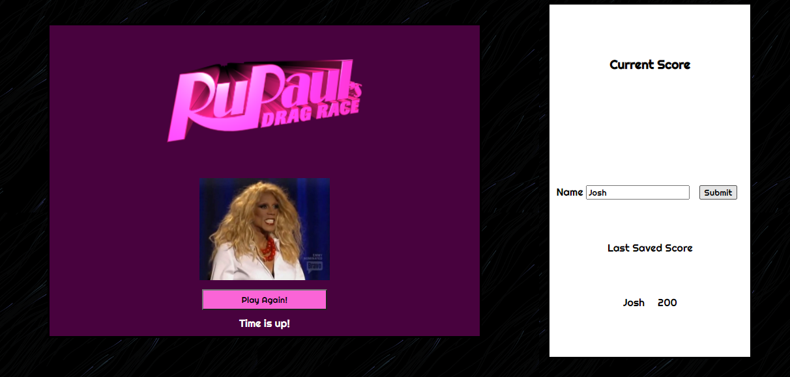

# RuPaul's Drag Race Coding-Quiz

## User Story

```
AS A user I want to answer questions in a race against the clock
THEN I want to save my last score
```

## Summary Photo

Click here:  to see the screenshot.

## Usage

This is a simple randomized quiz for RuPaul's Drag Race. This quiz consists of 10 questions with a 20 second allowed total time frame. Five seconds are removed every time a wrong answer is selected.

## URL

https://joshjankowski.github.io/Coding-Quiz/

## Author

Josh Jankowski

## Copyright
All Rights Reserved.